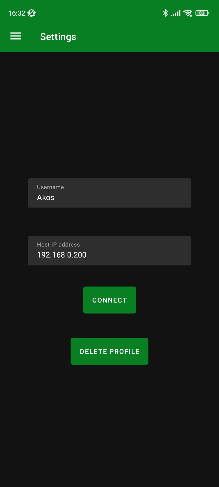
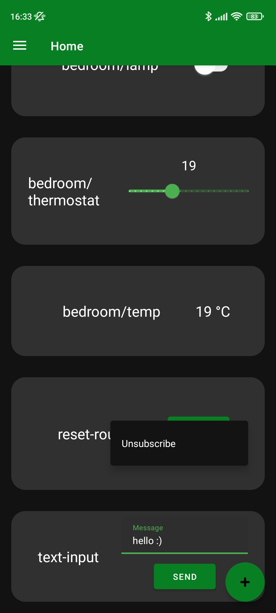
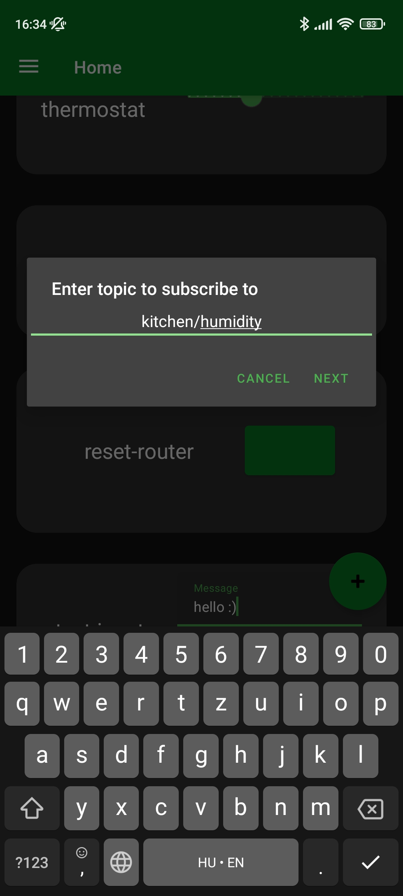
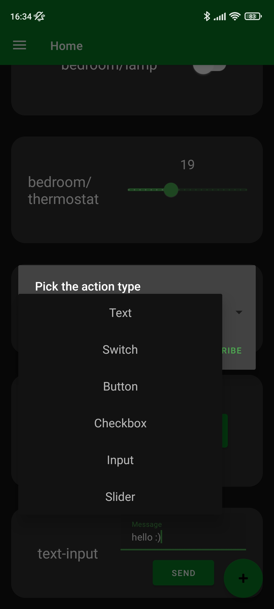
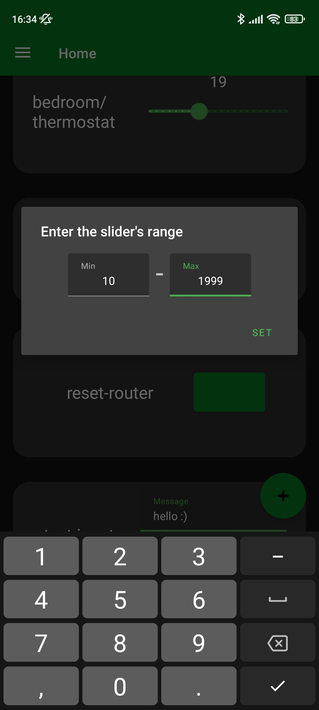

# Szakdolgozat-FMNUMU
 Smarthome hub and controller. 

Thesis work of Lovász Ákos.
Eszterházy Károly Katolikus Egyetem.

Planned features and progress can be tracked on this repo's [Trello board](https://trello.com/b/OiBK6wOh/szakdolgozat)

## The idea

During our hobby project developments, me and my friends bumped into a significant gap in available software for mobile that could essentially act as a central control hub for a smart home or similar MQTT based network of devices. Looking to fill this gap, I decided to make this app as my thesis work, this way I could make my homebrew projects come to life that are waiting for such an app to be created and at the same time I could present something useful and unique to the world of android apps.

## The execution

An Orange Pi (a SBC similar to Raspberry Pi) running linux hosts a Node-RED server and an MQTT Broker (Mosquitto), while the Android app is the primary control surface for the system. The Android app's main screen hosts the subscribed topics contained in seperate cards with hand picked interaction types such as switches, buttons, text inputs etc. and the connection screen is for configuring the host address (saved between sessions, optimally a one-time setup) and username. The subscribed topics, thus the primary control surface's cards are saved on a per user basis, so picking your user name on the connection will retain your subscribed topics between sessions. You can read more about it in [this document](https://github.com/Lovasz-Akos/Szakdolgozat-FMNUMU/blob/main/Doc/Szakdolgozat%20%C3%96sszegz%C3%A9s.pdf) (hungarian, english release tbd). The final version of the Node-RED flow will be uploaded sometime after april 19.

## Screenshots

### Android

|Connection screen                              |  Home screen                            | Context action
:----------------------------------------------:|:---------------------------------------:|:-------------------------------------------:|
   |   | 
|Subscription dialog                            | Card type selection                     | Slider range selection
|     |  | 

### Web dashboard


## Install Node-RED and Mosquitto

### Node-RED
```bash
sudo npm install -g --unsafe-perm node-red
```

### Mosquitto
```bash
apt-get install mosquitto
```

## Starting the servers

### Node-RED Server

```bash
node-red
```

### MQTT Broker

```bash
mosquitto -c mqtt.conf -d
```
note: 'mqtt.conf' is the path to your custom config, if you don't want to run it with default setting OR the auto-generated one.

for the config file's content use the (official man page)[https://mosquitto.org/man/mosquitto-conf-5.html]

### This has been automated by two entries into [pm2](https://pm2.keymetrics.io/)

The first entry just runs node-red-start

The second entry runs the following shell script to generate a config file for the mqtt broker, then runs the broker with this newly generated file

```bash
echo -n "listener 1883 " > mqtt.conf; ip -4 addr show eth0 | grep -oP '(?<=inet\s)\d+(\.\d+){3}' >> mqtt.conf; echo $"allow_anonymous true" >> mqtt.conf
```

> opens a listener on the 1883 port (mqtt default), then adds the server's current ipv4 address, and finally allows anonym connections* (*subject to change)
